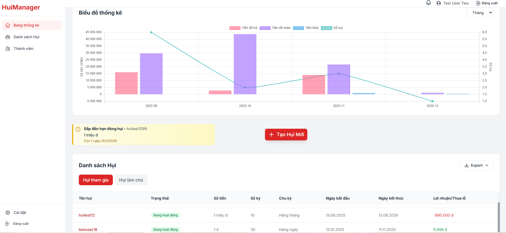
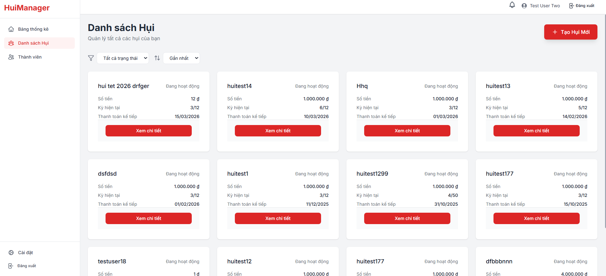
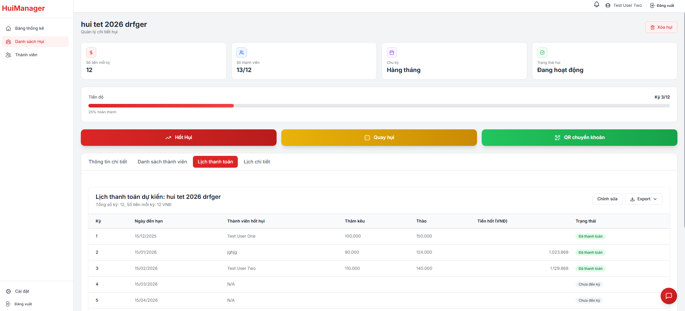

# Hui Manager

Hui Manager app is a full-featured service for managing rotating savings and credit associations (ROSCA). The platform allows users to create and manage hụi groups, track contributions and payouts by period, and view overall statistics for all active and completed hụi.

## Key Features

- **ROSCA Group Management:** Create, edit, and archive groups.
- **Period-based Accounting:** Detailed tracking of contributions and payouts for each member in every period.
- **Statistics:** Overall statistics for all hụi with filtering and analysis capabilities.
- **Data Export:** Export reports in Excel and PDF formats.
- **Group Chat:** Built-in chat for communication among group members.
- **Member Management:** Functionality to search for, add, and manage members.

## Screenshots

Here are some screenshots of the application:

| Screenshot 1 | Screenshot 2 | Screenshot 3 |
| :---: | :---: | :---: |
|  |  | 

## Technology Stack

- **Web Application:** [Next.js](https://nextjs.org/)
- **Mobile Version:** [Capacitor](https://capacitorjs.com/)
- **Database:** [PostgreSQL](https://www.postgresql.org/) with [Prisma](https://www.prisma.io/)
- **Authentication:** [NextAuth.js](https://next-auth.js.org/)
- **Styling:** [Tailwind CSS](https://tailwindcss.com/)

## Deployment

The project is planned to be deployed on a VPS using:

- **Containerization:** [Docker](https://www.docker.com/)
- **Web Server:** [NGINX](https://www.nginx.com/)
- **CI/CD:** [GitLab CI/CD](https://docs.gitlab.com/ee/ci/)

## Getting Started

To run the project in development mode, execute the following commands:

```bash
npm install
npm run dev
```

Open [http://localhost:3000](http://localhost:3000) in your browser to see the result.
